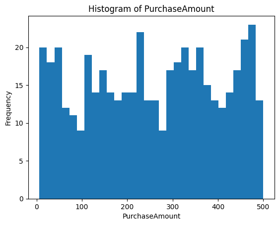
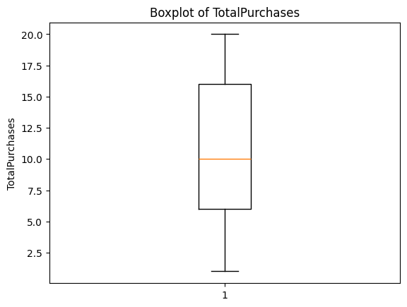
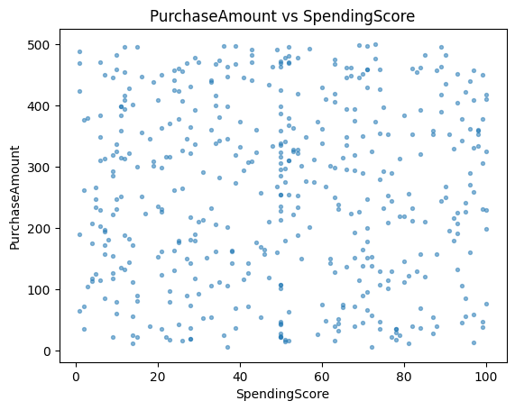

# Big Data Analytics – Customer Purchases (PySpark)

This repository shows a coursework-style project for **Big Data Analytics**, implemented using **PySpark**.
The aim is to demonstrate a clear workflow: loading data, cleaning, exploratory analysis, Spark SQL, and machine learning.

## How to Run
1. Install Python 3.10+ and Java (JDK 8/11/17).
2. Install dependencies: `pip install -r requirements.txt`
3. Run scripts from `src/` in order:
   - `01_data_prep.py`
   - `02_eda_sql.py`
   - `03_models.py`


## Methodology & Results (short)

### Methodology
In this coursework, I used **PySpark** to build a reproducible pipeline that follows the brief exactly.
1. **Data loading (Task 1).** I loaded `customer_purchases.csv` into a PySpark DataFrame and checked the schema and row count to understand data types and data quality.
2. **Data cleaning (Tasks 2–3).** Following the brief, I treated the value **0** as missing for relevant columns. I imputed the median (calculated **excluding zeros**) for `SpendingScore` and `TotalPurchases` to create the 2nd DataFrame, and then removed rows with zeros in `Age`, `AnnualIncome`, or `PurchaseAmount` to create the 3rd DataFrame for analysis and modelling.
3. **Exploratory analysis (Tasks 4–6).** I computed summary statistics for `PurchaseAmount` and produced a histogram. I calculated quartiles for `TotalPurchases` and used a boxplot to assess spread and potential outliers. I also explored the relationship between `PurchaseAmount` and `SpendingScore` with a scatter plot and calculated the **Pearson correlation**.
4. **Spark SQL (Task 7).** I registered a temporary view on the cleaned DataFrame and ran the required SQL to list customers where `Age < 50` and `SpendingScore > 100`.
5. **Feature preparation and modelling (Tasks 8–10).** I encoded `Gender` and `PurchaseCategory` with `StringIndexer`/`OneHotEncoder`, assembled features with `VectorAssembler`, and trained (i) a **Decision Tree** and (ii) **Logistic Regression** to predict `Outcome`. I also trained a **Linear Regression** model to predict `PurchaseAmount` from `AnnualIncome`.
6. **Evaluation.** For classification, I reported **Accuracy**, **F1**, and **AUROC**; for regression, I reported **RMSE** and **R²**. Plots are saved under `figures/`, SQL output under `outputs/`, and metrics in `outputs/metrics.json`.

### Results (high level)
- **Data quality change:** The number of rows removed is printed as `|df2| − |df3|`, showing how much missingness was addressed.
- **`PurchaseAmount` distribution:** Histogram and summary statistics (min, max, mean, median, variance, std. dev.) give a clear view of central tendency and spread.
- **`TotalPurchases` quartiles & boxplot:** Q1/Median/Q3 and the boxplot indicate dispersion and potential outliers.
- **Association of `PurchaseAmount` and `SpendingScore`:** Scatter plot shows the pattern; **Pearson correlation** quantifies linear association.
- **Model performance:** Decision Tree and Logistic Regression metrics (Accuracy, F1, AUROC) and Linear Regression metrics (RMSE, R²) are logged and saved to `outputs/metrics.json`.

## How the Brief Maps to This Repository

This project follows the ten assessment tasks exactly. Each task is mapped to a script and outputs:

1. **Task 1 — Load dataset & describe structure**  
   - **Script:** `src/01_data_prep.py`  
   - **Produces:** Schema + row count; Parquet checkpoint `data/parquet/df1`.

2. **Task 2 — Replace zeros with medians for `SpendingScore` and `TotalPurchases`**  
   - **Script:** `src/01_data_prep.py`  
   - **Produces:** Imputed DataFrame `df2` (medians computed excluding zeros); `data/parquet/df2`.

3. **Task 3 — Remove rows with zeros in `Age`, `AnnualIncome`, `PurchaseAmount`**  
   - **Script:** `src/01_data_prep.py`  
   - **Produces:** Cleaned DataFrame `df3`; `data/parquet/df3`.

4. **Task 4 — Rows removed, summary stats, histogram for `PurchaseAmount`**  
   - **Script:** `src/02_eda_sql.py`  
   - **Produces:** Console stats; `figures/purchase_amount_hist.png`.

5. **Task 5 — Quartiles & boxplot for `TotalPurchases`**  
   - **Script:** `src/02_eda_sql.py`  
   - **Produces:** Q1/Median/Q3 in console; `figures/total_purchases_boxplot.png`.

6. **Task 6 — Scatter + Pearson correlation (`PurchaseAmount` vs `SpendingScore`)**  
   - **Script:** `src/02_eda_sql.py`  
   - **Produces:** `figures/purchase_vs_spending_scatter.png` and printed correlation.

7. **Task 7 — Spark SQL (`Age < 50` and `SpendingScore > 100`)**  
   - **Script:** `src/02_eda_sql.py`  
   - **Produces:** `outputs/sql_query_result/` (CSV) + console sample.

8. **Task 8 — Decision Tree classifier (`Outcome`)**  
   - **Script:** `src/03_models.py`  
   - **Produces:** Metrics (Accuracy, F1, AUROC) saved to `outputs/metrics.json`.

9. **Task 9 — Logistic Regression classifier (`Outcome`)**  
   - **Script:** `src/03_models.py`  
   - **Produces:** Metrics saved to `outputs/metrics.json`.

10. **Task 10 — Linear Regression: `PurchaseAmount ~ AnnualIncome`**  
    - **Script:** `src/03_models.py`  
    - **Produces:** RMSE & R² saved to `outputs/metrics.json`.

## Findings (paste into your report after running the code)

> Replace the bracketed placeholders with your actual numbers from the console and `outputs/metrics.json`.

- **Rows removed (Task 4):** We removed **[N]** rows when moving from `df2` to `df3`, indicating the proportion of entries with missing (zero) values in the required fields.
- **`PurchaseAmount` summary (Task 4):** min = **[min]**, max = **[max]**, mean = **[mean]**, median = **[median]**, variance = **[variance]**, std. dev. = **[stddev]**. The histogram suggests the distribution is **[roughly symmetric / right-skewed / left-skewed]** with **[few/many]** extreme values.
- **`TotalPurchases` quartiles (Task 5):** Q1 = **[q1]**, Median = **[q2]**, Q3 = **[q3]**. The boxplot indicates **[tight/moderate/wide]** dispersion and **[presence/absence]** of outliers.
- **Correlation (Task 6):** The Pearson correlation between `PurchaseAmount` and `SpendingScore` is **[corr]**, which indicates a **[weak/moderate/strong] [positive/negative]** linear relationship.
- **Decision Tree performance (Task 8):** Accuracy = **[acc_dt]**, F1 = **[f1_dt]**, AUROC = **[auroc_dt]**.
- **Logistic Regression performance (Task 9):** Accuracy = **[acc_lr]**, F1 = **[f1_lr]**, AUROC = **[auroc_lr]**.
- **Linear Regression performance (Task 10):** RMSE = **[rmse]**, R² = **[r2]**. Interpretation: the model explains **[x%]** of the variance in `PurchaseAmount`, where `x = 100 × R²`.

> You can find the metrics in `outputs/metrics.json` after running `src/03_models.py`. Plots are saved under `figures/` to support the narrative.


## Recruiter TL;DR

This project is a compact **end‑to‑end PySpark pipeline**: data cleaning → EDA & visualisation → Spark SQL → ML models (Decision Tree, Logistic Regression, Linear Regression).  
It is reproducible (scripts, requirements, outputs folder), uses **Spark MLlib**, and saves **metrics** and **figures** for quick review.

**Skills demonstrated:** PySpark (DataFrame API, SQL), MLlib (classifiers & regression), feature engineering, exploratory analysis, plotting, pipeline structuring, reproducibility, and clear documentation.

**Run time:** Designed to run locally with Python + Java. Figures and metrics are written to `figures/` and `outputs/`.


## Project Screenshots

> Generated automatically after you run `make eda` (or `python src/02_eda_sql.py`).

**Histogram — PurchaseAmount**  
Shows overall distribution and spread.  


**Boxplot — TotalPurchases**  
Highlights dispersion and potential outliers.  


**Scatter — PurchaseAmount vs SpendingScore**  
Visualises relationship; the Pearson correlation is printed to console during EDA.  


## 30‑Second Interview Pitch

I built an end‑to‑end **PySpark** project on a retail purchases dataset to demonstrate practical big‑data skills. 
Starting with raw CSV, I treated zeros as missing, did median imputation, and created a clean DataFrame for analysis and modeling. 
I ran EDA with summary stats and plots, executed a Spark SQL filter query, and trained three MLlib models: Decision Tree, Logistic Regression, and Linear Regression. 
The repo is reproducible, with checkpoints, generated figures, saved metrics, a Makefile, and a Dockerfile so anyone can run it quickly. 
It shows I can design a small but complete data pipeline, reason about data quality, and explain model results clearly.


---

## Best (Professional) Setup

### 1) Local run (create artefacts)
```bash
python -m pip install -r requirements.txt
python src/01_data_prep.py
python src/02_eda_sql.py
python src/03_models.py
# Optional: auto-fill a Findings file from artefacts
python src/04_autofill_report.py
```

### 2) Initialize Git and push
```bash
git init
git add .
git commit -m "Init: PySpark big-data portfolio project"
git branch -M main
git remote add origin https://github.com/<your-username>/<repo-name>.git
git push -u origin main
```

### 3) Enable CI (auto-runs pipeline on every push)
- After pushing, GitHub Actions will run **PySpark CI** and upload **figures** + **outputs** as build artifacts.
- Optional linting runs via **pre-commit** (configure locally with `pip install -r dev-requirements.txt && pre-commit install`).

### 4) Add README badges (replace placeholders)
```


```
